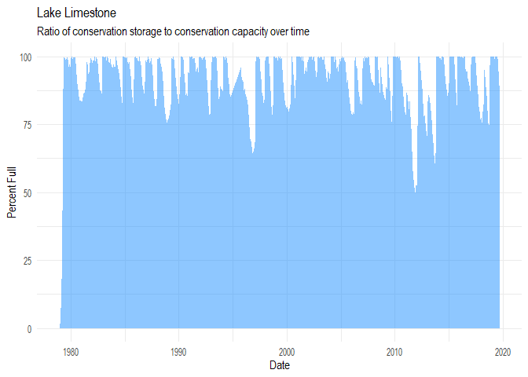
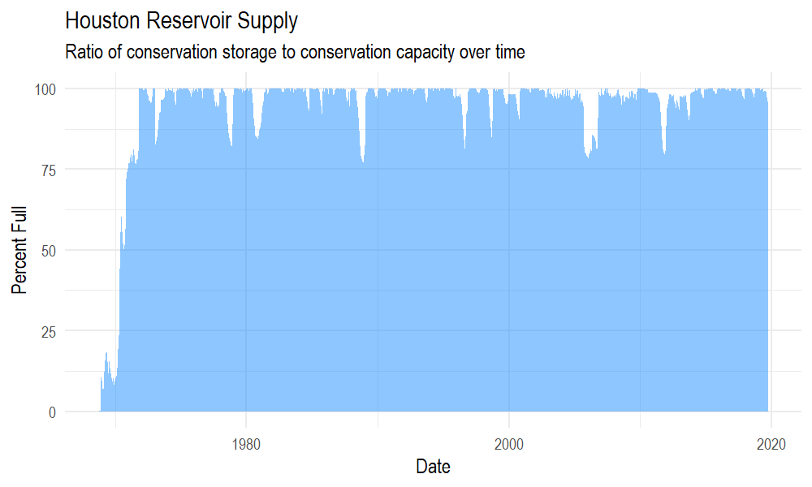
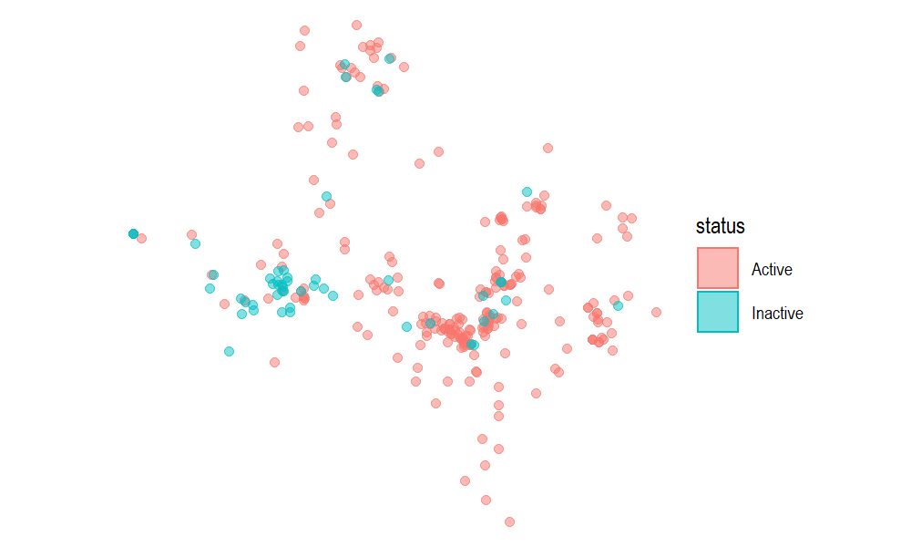
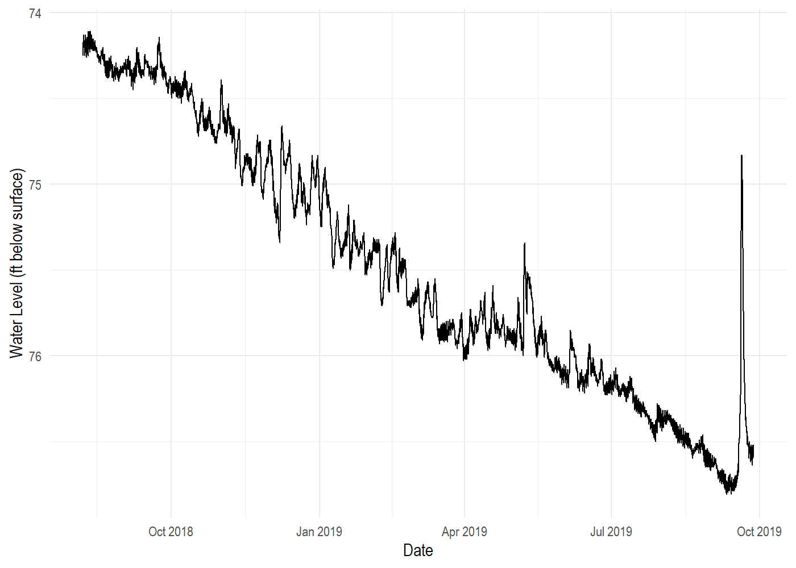
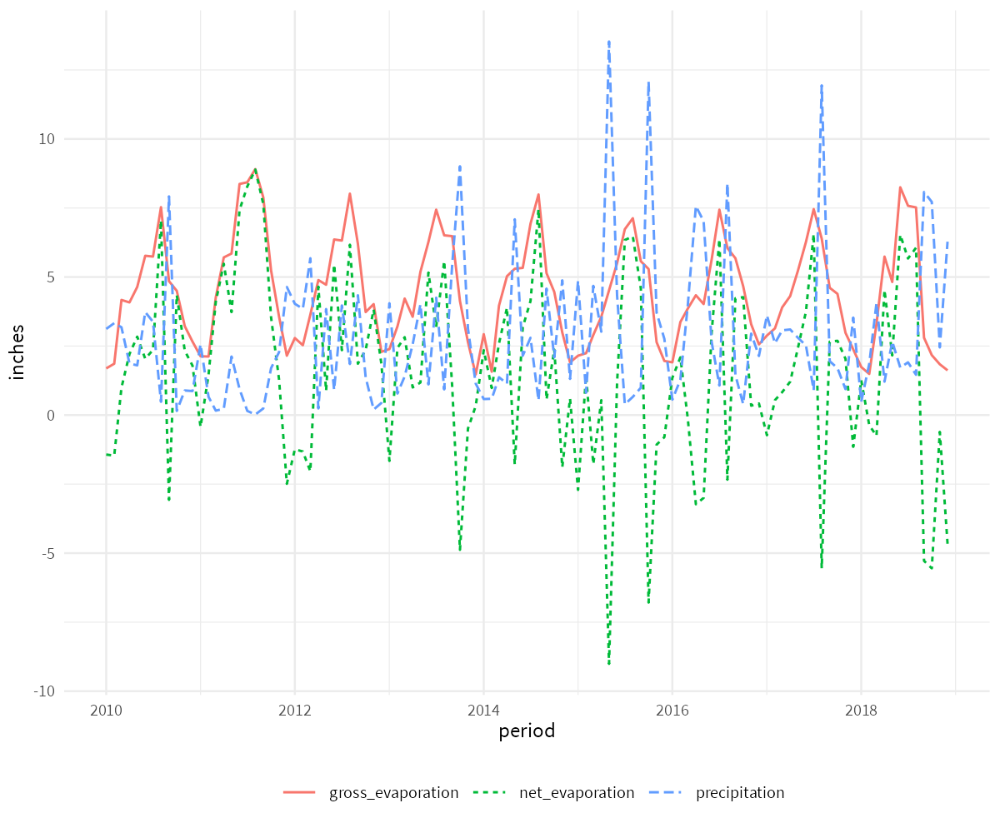
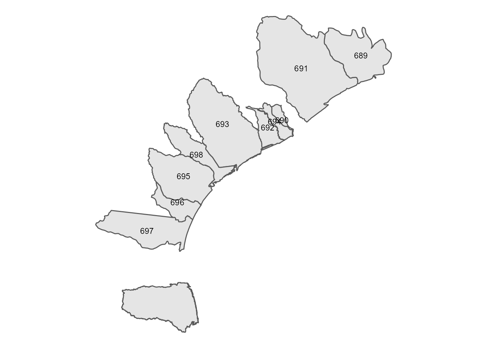
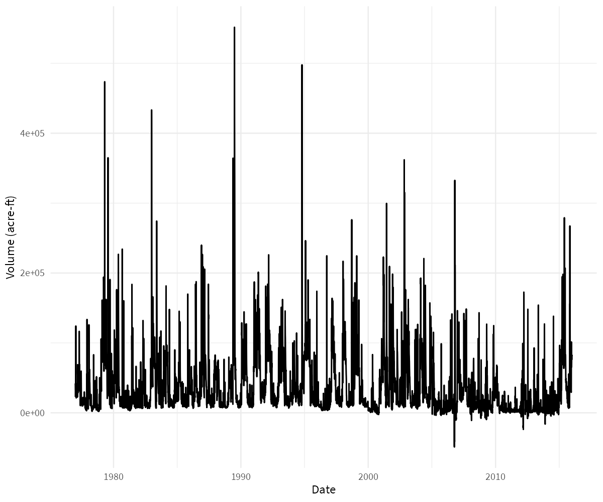

-   [wd4tx](#wd4tx)
-   [Installation](#installation)
-   [Usage](#usage)
    -   [Download Reservoir Storage Data](#download-reservoir-storage-data)
    -   [Download Individual Well Data](#download-individual-well-data)
    -   [Download Evaporation and Precipitation Data](#download-evaporation-and-precipitation-data)
    -   [Download Coastal Freshwater Inflow Data](#download-coastal-freshwater-inflow-data)
    -   [Download Coastal Water Quality Data](#download-coastal-water-quality-data)

<!-- README.md is generated from README.Rmd. Please edit that file -->
wd4tx
=====

[](https://www.tidyverse.org/lifecycle/#experimental)

`wd4tx` is an R interface for downloading data from the Texas Water Development Board's (TWDB) Water Data For Texas data portal (<https://www.waterdatafortexas.org>). Core functions include:

-   `download_reservoir()`: Absolute and relative water supply reservoir storage (for individual reservoirs and aggregated by planning area, municipality, river basin, and climate region)
-   `download_well()`: Groundwater well levels
-   `download_lep()`: Precipitation and evaporation by quad
-   `download_coastal_site_data()`: TWDB coastal water quality (primarily salinity and dissolved oxygen) data
-   `download_coastal_hydrology()`: TWDB freshwater inflow estiamtes for bays and estuaries

This package is not affliated with the TWDB. Any questions or issues should be directed to: <https://github.com/mps9506/wd4tx/issues>

Installation
============

`wd4tx` is not on CRAN. In order to install, use `devtools`.

``` r
install.packages("devtools")
devtools::install_github("mps9506/wd4tx")
```

Usage
=====

Download Reservoir Storage Data
-------------------------------

TWDB provides data for the percent storage, reservoir storage (acre-feet), conservation storage (acre-feet), and conservation capacity (acre-feet) for the water supply (and some flood control) reservoirs used by the state of Texas. The data is available for individual reservoirs, or aggregated by state planning area, river basin, municipal supply, and climate regions. See <https://www.waterdatafortexas.org/reservoirs/statewide> for more details.

### Download individual reservoir storage data

``` r
library(wd4tx)
library(tidyverse)

df <- download_reservoir(reservoir = "limestone")
df <- df %>%
  mutate(date = as.Date(date),
         water_level = as.numeric(water_level),
         surface_area = as.numeric(surface_area))

ggplot(df) +
  geom_area(aes(date, percent_full), 
            fill = "dodgerblue",
            alpha = 0.50) +
  labs(y = "Percent Full", x = "Date",
       title = "Lake Limestone",
       subtitle = "Ratio of conservation storage to conservation capacity over time") +
  theme_minimal(base_family = "Arial Narrow",
                base_size = 9)
```



### Download reservoir storage data aggregated by municipality

``` r

df <- download_reservoir(aggregate_by = "municipal",
                         region_name = "houston")
df <- df %>%
  mutate(date = as.Date(date))

ggplot(df) +
  geom_area(aes(date, percent_full), 
            fill = "dodgerblue",
            alpha = 0.50) +
  labs(y = "Percent Full", x = "Date",
       title = "Houston Reservoir Supply",
       subtitle = "Ratio of conservation storage to conservation capacity over time") +
  theme_minimal(base_family = "Arial Narrow",
                base_size = 9)
```



Download Individual Well Data
-----------------------------

TWDB provides water level measurements from a statewide network of well level recorders. To download the information, all that is needed is the state well number. This information can be accessed with the `download_well_meta()` function. This will provide a `sf` dataframe:

``` r
df <- download_well_meta()

df
#> Simple feature collection with 286 features and 6 fields
#> geometry type:  POINT
#> dimension:      XY
#> bbox:           xmin: -106.6058 ymin: 26.04472 xmax: -94.07056 ymax: 36.24333
#> epsg (SRID):    4326
#> proj4string:    +proj=longlat +datum=WGS84 +no_defs
#> # A tibble: 286 x 7
#>    aquifer aquifer_type county entity status well_number
#>    <chr>   <chr>        <chr>  <chr>  <chr>  <chr>      
#>  1 Carriz~ Confined     Ander~ Texas~ Active 3813106    
#>  2 Ogalla~ Unconfined   Armst~ Panha~ Inact~ 0652603    
#>  3 Ogalla~ Unconfined   Armst~ Panha~ Active 0653401    
#>  4 Ogalla~ Unconfined   Armst~ Panha~ Active 0655504    
#>  5 Carriz~ Confined     Atasc~ Texas~ Active 7804508    
#>  6 Ogalla~ Unconfined   Bailey Texas~ Active 1051909    
#>  7 Edward~ Unconfined   Bande~ U.S. ~ Active 6912206    
#>  8 Trinity Confined     Bande~ Texas~ Active 6924225    
#>  9 Carriz~ Unconfined   Bastr~ Texas~ Active 5862208    
#> 10 Seymour Unconfined   Baylor Texas~ Active 2122850    
#> # ... with 276 more rows, and 1 more variable: geometry <POINT [°]>
```

``` r
ggplot(df) +
  geom_sf(aes(color = status, fill = status), alpha = 0.5) +
  theme_void(base_family = "Arial Narrow",
             base_size = 9)
```



``` r
df <- download_well("6507905")

df <- df %>%
  mutate(datetime = as.POSIXct(datetime))

ggplot(df) +
  geom_line(aes(datetime, `water_level(ft below land surface)`)) +
  scale_y_reverse() +
  labs(y = "Water Level (ft below surface)",
       x = "Date") +
  theme_minimal(base_family = "Arial Narrow",
                base_size = 9)
```



Download Evaporation and Precipitation Data
-------------------------------------------

``` r
df <- download_lep(quad = "710", 
                   start_date = "2010-01",
                   end_date = "2018-12")
df <- df %>%
  pivot_longer(cols = -period,
               names_to = "label",
               values_to = "inches") %>%
  mutate(period = lubridate::ymd(period, truncated = 2))

ggplot(df) +
  geom_line(aes(period, inches, color = label, linetype = label)) +
  theme_minimal(base_family = "Arial Narrow",
                base_size = 9) +
  theme(legend.position = "bottom",
        legend.direction = "horizontal",
        legend.title = element_blank())
```



Download Coastal Freshwater Inflow Data
---------------------------------------

Estimated freshwater inflows and inflow balances for Texas estuaries are provided to support environmental and water planning studies. Details are here: <https://www.waterdatafortexas.org/coastal/hydrology>

A `geoid` argument is required to identify the watershed data is requested for. Use `download_coastal_geometry()` to download `sf` files which include the name, location, and id.

``` r
df <- download_coastal_geometry(type = "watershed")
df
#> Simple feature collection with 10 features and 4 fields
#> geometry type:  MULTIPOLYGON
#> dimension:      XY
#> bbox:           xmin: -98.91209 ymin: 25.8544 xmax: -93.5491 ymax: 30.75851
#> epsg (SRID):    4326
#> proj4string:    +proj=longlat +datum=WGS84 +no_defs
#> # A tibble: 10 x 5
#>    name   extradata$displ~ $watershed    id type                   geometry
#>    <chr>  <chr>            <chr>      <int> <chr>       <MULTIPOLYGON [°]>
#>  1 sabine Sabine Lake      sabine       689 Feat~ (((-94.02172 30.37507, -~
#>  2 brazo~ Brazos River Es~ brazos_ri~   691 Feat~ (((-95.53541 30.71278, -~
#>  3 galve~ Galveston Bay    galveston    690 Feat~ (((-95.53244 29.20769, -~
#>  4 matag~ Matagorda Bay    matagorda    694 Feat~ (((-95.98934 29.30877, -~
#>  5 san_b~ San Bernard Riv~ san_berna~   692 Feat~ (((-95.61194 28.77265, -~
#>  6 east_~ East Matagorda ~ east_mata~   693 Feat~ (((-97.13136 29.64649, -~
#>  7 arans~ Aransas Bay      aransas      695 Feat~ (((-97.5819 27.94688, -9~
#>  8 corpu~ Corpus Christi ~ corpus_ch~   696 Feat~ (((-97.82122 28.2044, -9~
#>  9 lagun~ Laguna Madre Es~ laguna_ma~   697 Feat~ (((-97.54611 27.65115, -~
#> 10 san_a~ San Antonio Bay  san_anton~   698 Feat~ (((-96.83909 28.17699, -~
```

Valid type arguments include `c(basin", "bay", "estuary", "sub_watershed", "watershed")`. Some types return simple features with topological errors. An example of one way to deal with this is shown below:

``` r
library(sf)
df <- df %>%
  st_transform(crs = 3081) %>%
  st_simplify()

ggplot(df) +
  geom_sf() +
  geom_sf_text(aes(label = id), size = 3) +
  theme_void(base_size = 9)
```



With a valid id number, `download_coastal_hydrology()` can be used to download freshwater inflow data for the specified feature.

``` r
df <- download_coastal_hydrology(geoid = "689")
df <- df %>%
  mutate(date = as.Date(date))

ggplot(df) +
  geom_line(aes(date, fresh_in)) +
    theme_minimal(base_family = "Arial Narrow",
                base_size = 9) +
  labs(x = "Date", y = "Volume (acre-ft)") +
  theme(legend.position = "bottom",
        legend.direction = "horizontal",
        legend.title = element_blank())
```



Download Coastal Water Quality Data
-----------------------------------

A list of sites is available with the `download_coastal_sites()` function:

``` r
df <- download_coastal_sites(all_stations = TRUE)
df
#> # A tibble: 136 x 14
#>    description estuary status_id min_date the_geom$type $coordinates    id
#>    <chr>       <chr>       <int> <chr>    <chr>         <list>       <int>
#>  1 East Bay @~ Colora~         8 2018-07~ Point         <dbl [2]>      208
#>  2 West Bay @~ Colora~         3 1994-01~ Point         <dbl [2]>      202
#>  3 West Bay @~ Colora~         2 2001-02~ Point         <dbl [2]>      205
#>  4 West Bay @~ Colora~         2 1992-12~ Point         <dbl [2]>      206
#>  5 Mad Island~ Colora~         3 2015-11~ Point         <dbl [2]>      204
#>  6 Aransas Ba~ Missio~         3 1986-12~ Point         <dbl [2]>       65
#>  7 Port Arans~ <NA>            4 1995-10~ Point         <dbl [2]>      258
#>  8 Lydia Ann ~ Missio~         4 1995-09~ Point         <dbl [2]>      259
#>  9 Corpus Chr~ Missio~         4 1995-09~ Point         <dbl [2]>      260
#> 10 GIWW nr Co~ <NA>            4 1995-09~ Point         <dbl [2]>      261
#> # ... with 126 more rows, and 12 more variables:
#> #   stationstatus$description <chr>, $id <int>, $name <chr>, name <chr>,
#> #   agency$abbreviation <chr>, $id <int>, $name <chr>, station_code <chr>,
#> #   coordinates <list>, bay <chr>, max_date <chr>, basin <chr>
```

A list of parameters measured at that station are available using `download_coastal_site_parameters()`:

``` r
df <- download_coastal_site_parameters("SAB2")
df %>% select(units_name, code, name)
#> # A tibble: 9 x 3
#>   units_name   code                   name                                 
#>   <chr>        <chr>                  <chr>                                
#> 1 PSU          seawater_salinity      Salinity                             
#> 2 m            water_depth_nonvented  Water Depth  - vertical distance bel~
#> 3 mgl          water_dissolved_oxyge~ Dissolved Oxygen Concentration       
#> 4 v            instrument_battery_vo~ Battery Voltage                      
#> 5 mS/cm        water_electrical_cond~ Electrical Conductivity (Not Normali~
#> 6 mS/cm        water_specific_conduc~ Specific Conductance (Normalized @25~
#> 7 C            water_temperature      Water Temperature                    
#> 8 %            water_dissolved_oxyge~ Dissolved Oxygen Saturation Concentr~
#> 9 dimensionle~ water_ph               pH Level
```

``` r
df <- download_coastal_site_data(station = "SAB2",
                                 parameter = "seawater_salinity",
                                 start_date = "2010-01-01",
                                 end_date = "2018-01-01",
                                 bin = "hour")
df %>%
  mutate(datetime_utc = as.POSIXct(datetime_utc))
#> # A tibble: 60,511 x 2
#>    value datetime_utc       
#>    <dbl> <dttm>             
#>  1 8.85  2010-01-01 00:00:00
#>  2 7.21  2010-01-01 00:00:00
#>  3 6.31  2010-01-01 00:00:00
#>  4 4.81  2010-01-01 00:00:00
#>  5 3.53  2010-01-01 00:00:00
#>  6 2.38  2010-01-01 00:00:00
#>  7 1.85  2010-01-01 00:00:00
#>  8 1.04  2010-01-01 00:00:00
#>  9 0.96  2010-01-01 00:00:00
#> 10 0.879 2010-01-01 00:00:00
#> # ... with 60,501 more rows
```
