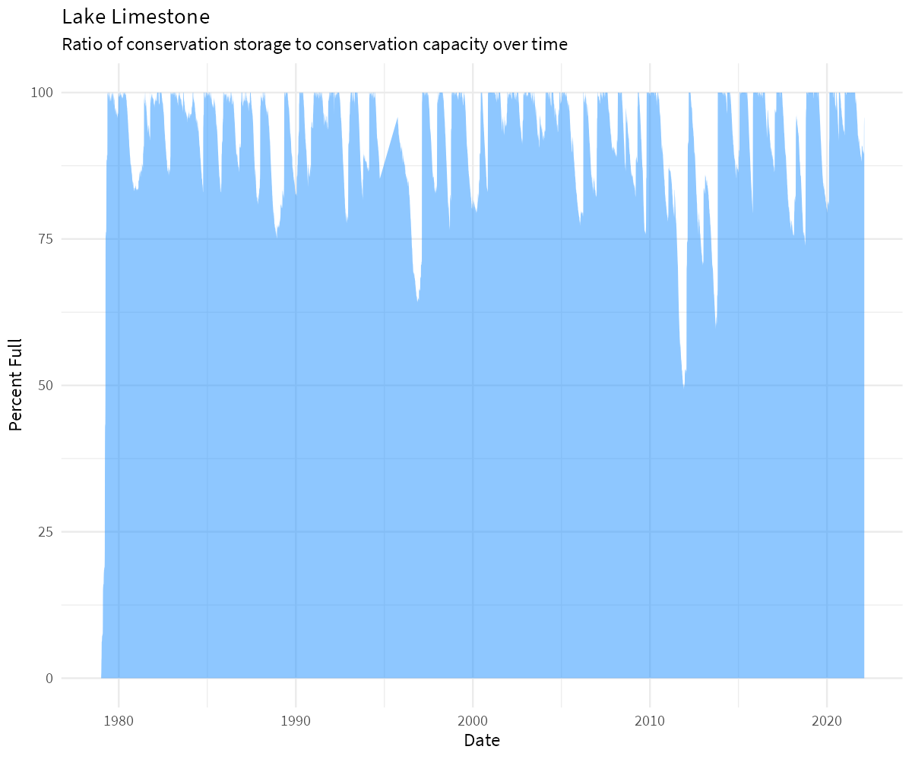

<!-- README.md is generated from README.Rmd. Please edit that file -->

# wd4tx

<!-- badges: start -->

[](https://www.tidyverse.org/lifecycle/#experimental)
[](https://choosealicense.com/)
<!-- badges: end -->

`wd4tx` is an R interface for downloading data from the Texas Water
Development Board’s (TWDB) Water Data For Texas data portal
(<https://www.waterdatafortexas.org>). Core functions include:

-   `download_reservoir()`: Absolute and relative water supply reservoir
    storage (for individual reservoirs and aggregated by planning area,
    municipality, river basin, and climate region)
-   `download_well()`: Groundwater well levels
-   `download_lep()`: Precipitation and evaporation by quad
-   `download_coastal_site_data()`: TWDB coastal water quality
    (primarily salinity and dissolved oxygen) data
-   `download_coastal_hydrology()`: TWDB freshwater inflow estimates for
    bays and estuaries

This package is not affiliated with the TWDB. Any questions or issues
should be directed to: <https://github.com/TxWRI/wd4tx/issues>

# Installation

`wd4tx` is not on CRAN. In order to install, use `devtools`.

``` r
install.packages("devtools")
devtools::install_github("TxWRI/wd4tx")
```

# Usage

## Download Reservoir Storage Data

TWDB provides data for the percent storage, reservoir storage
(acre-feet), conservation storage (acre-feet), and conservation capacity
(acre-feet) for the water supply (and some flood control) reservoirs
used by the state of Texas. The data is available for individual
reservoirs, or aggregated by state planning area, river basin, municipal
supply, and climate regions. See
<https://www.waterdatafortexas.org/reservoirs/statewide> for more
details.

### Download individual reservoir storage data

``` r
library(wd4tx)
library(tidyverse)

df <- download_reservoir(reservoir = "limestone")
df <- df %>%
  mutate(date = as.Date(date),
         water_level = as.numeric(water_level),
         surface_area = as.numeric(surface_area))

ggplot(df) +
  geom_area(aes(date, percent_full), 
            fill = "dodgerblue",
            alpha = 0.50) +
  labs(y = "Percent Full", x = "Date",
       title = "Lake Limestone",
       subtitle = "Ratio of conservation storage to conservation capacity over time") +
  theme_minimal(base_family = "Arial Narrow",
                base_size = 9)
```



### Download reservoir storage data aggregated by municipality

``` r
df <- download_reservoir(aggregate_by = "municipal",
                         region_name = "houston")
df <- df %>%
  mutate(date = as.Date(date))

ggplot(df) +
  geom_area(aes(date, percent_full), 
            fill = "dodgerblue",
            alpha = 0.50) +
  labs(y = "Percent Full", x = "Date",
       title = "Houston Reservoir Supply",
       subtitle = "Ratio of conservation storage to conservation capacity over time") +
  theme_minimal(base_family = "Arial Narrow",
                base_size = 9)
```


## Download Individual Well Data

TWDB provides water level measurements from a statewide network of well
level recorders. To download the information, all that is needed is the
state well number. This information can be accessed with the
`download_well_meta()` function. This will provide a `sf` dataframe:

``` r
df <- download_well_meta()

df
#> Simple feature collection with 302 features and 6 fields
#> Geometry type: POINT
#> Dimension:     XY
#> Bounding box:  xmin: -106.6058 ymin: 26.04472 xmax: -94.07056 ymax: 36.24333
#> Geodetic CRS:  WGS 84
#> # A tibble: 302 x 7
#>    aquifer  aquifer_type county   entity                     status  well_number
#>    <chr>    <chr>        <chr>    <chr>                      <chr>   <chr>      
#>  1 Ogallala Unconfined   Dallam   Texas Water Development B~ Active  0260303    
#>  2 Ogallala Unconfined   Hansford Texas Water Development B~ Active  0354301    
#>  3 Ogallala Unconfined   Roberts  Panhandle GCD              Active  0503709    
#>  4 Ogallala Unconfined   Roberts  Texas Water Development B~ Active  0509553    
#>  5 Ogallala Unconfined   Roberts  Panhandle GCD              Active  0510953    
#>  6 Ogallala Unconfined   Roberts  Texas Water Development B~ Active  0517203    
#>  7 Ogallala Unconfined   Gray     Panhandle GCD              Active  0526501    
#>  8 Ogallala Unconfined   Wheeler  Panhandle GCD              Active  0529505    
#>  9 Ogallala Unconfined   Wheeler  Texas Water Development B~ Inacti~ 0529711    
#> 10 Other    Unconfined   Wheeler  Panhandle GCD              Active  0539904    
#> # ... with 292 more rows, and 1 more variable: geometry <POINT [°]>
```

``` r
ggplot(df) +
  geom_sf(aes(color = status, fill = status), alpha = 0.5) +
  theme_void(base_family = "Arial Narrow",
             base_size = 9)
```


``` r
df <- download_well("6507905")

df <- df %>%
  mutate(datetime = as.POSIXct(datetime))

ggplot(df) +
  geom_line(aes(datetime, `water_level(ft below land surface)`)) +
  scale_y_reverse() +
  labs(y = "Water Level (ft below surface)",
       x = "Date") +
  theme_minimal(base_family = "Arial Narrow",
                base_size = 9)
```


## Download Evaporation and Precipitation Data

``` r
df <- download_lep(quad = "710", 
                   start_date = "2010-01",
                   end_date = "2018-12")
df <- df %>%
  pivot_longer(cols = -period,
               names_to = "label",
               values_to = "inches") %>%
  mutate(period = lubridate::ymd(period, truncated = 2))

ggplot(df) +
  geom_line(aes(period, inches, color = label, linetype = label)) +
  theme_minimal(base_family = "Arial Narrow",
                base_size = 9) +
  theme(legend.position = "bottom",
        legend.direction = "horizontal",
        legend.title = element_blank())
```


## Download Coastal Freshwater Inflow Data

Estimated freshwater inflows and inflow balances for Texas estuaries are
provided to support environmental and water planning studies. Details
are here: <https://www.waterdatafortexas.org/coastal/hydrology>

A `geoid` argument is required to identify the watershed data is
requested for. Use `download_coastal_geometry()` to download `sf` files
which include the name, location, and id.

``` r
df <- download_coastal_geometry(type = "watershed")
df
#> Simple feature collection with 10 features and 4 fields
#> Geometry type: MULTIPOLYGON
#> Dimension:     XY
#> Bounding box:  xmin: -98.91209 ymin: 25.8544 xmax: -93.5491 ymax: 30.75851
#> Geodetic CRS:  WGS 84
#> # A tibble: 10 x 5
#>    type    name   extradata$displa~ $watershed    id                    geometry
#>    <chr>   <chr>  <chr>             <chr>      <int>          <MULTIPOLYGON [°]>
#>  1 Feature sabine Sabine Lake       sabine       689 (((-94.02172 30.37507, -94~
#>  2 Feature brazo~ Brazos River Est~ brazos_ri~   691 (((-95.53541 30.71278, -95~
#>  3 Feature galve~ Galveston Bay     galveston    690 (((-95.53244 29.20769, -95~
#>  4 Feature matag~ Matagorda Bay     matagorda    694 (((-95.98934 29.30877, -95~
#>  5 Feature san_b~ San Bernard Rive~ san_berna~   692 (((-95.61194 28.77265, -95~
#>  6 Feature east_~ East Matagorda B~ east_mata~   693 (((-97.13136 29.64648, -97~
#>  7 Feature arans~ Aransas Bay       aransas      695 (((-97.5819 27.94688, -97.~
#>  8 Feature corpu~ Corpus Christi B~ corpus_ch~   696 (((-97.82122 28.2044, -97.~
#>  9 Feature lagun~ Laguna Madre Est~ laguna_ma~   697 (((-97.54611 27.65115, -97~
#> 10 Feature san_a~ San Antonio Bay   san_anton~   698 (((-96.83909 28.177, -96.8~
```

Valid type arguments include
`c(basin", "bay", "estuary", "sub_watershed", "watershed")`. Some types
return simple features with topological errors. An example of one way to
deal with this is shown below:

``` r
library(sf)
df <- df %>%
  st_transform(crs = 3081) %>%
  st_simplify()

ggplot(df) +
  geom_sf() +
  geom_sf_text(aes(label = id), size = 3) +
  theme_void(base_size = 9)
```


With a valid id number, `download_coastal_hydrology()` can be used to
download freshwater inflow data for the specified feature.

``` r
df <- download_coastal_hydrology(geoid = "689")
df <- df %>%
  mutate(date = as.Date(date))

ggplot(df) +
  geom_line(aes(date, fresh_in)) +
    theme_minimal(base_family = "Arial Narrow",
                base_size = 9) +
  labs(x = "Date", y = "Volume (acre-ft)") +
  theme(legend.position = "bottom",
        legend.direction = "horizontal",
        legend.title = element_blank())
```


## Download Coastal Water Quality Data

A list of sites is available with the `download_coastal_sites()`
function:

``` r
df <- download_coastal_sites(all_stations = TRUE)
df
#> # A tibble: 137 x 14
#>       id station_code name    description   stationstatus$id $name $description 
#>    <int> <chr>        <chr>   <chr>                    <int> <chr> <chr>        
#>  1   208 6980         <a hre~ "East Bay @ ~                1 live  Station is r~
#>  2   202 6984         <a hre~ "West Bay @ ~                1 live  Station is r~
#>  3   205 6985         <a hre~ "West Bay @ ~                1 live  Station is r~
#>  4   206 6990         <a hre~ "West Bay @ ~                1 live  Station is r~
#>  5   204 6996         <a hre~ "Mad Island ~                1 live  Station is r~
#>  6    65 ARA          Mid Ar~ "Aransas Bay~                3 reti~ Station is r~
#>  7   258 ARA_1        ARA_1   "Port Aransa~                4 temp~ Station was ~
#>  8   259 ARA_2        ARA_2   "Lydia Ann C~                4 temp~ Station was ~
#>  9   260 ARA_3        ARA_3   "Corpus Chri~                4 temp~ Station was ~
#> 10   261 ARA_4        ARA_4   "GIWW nr Cov~                4 temp~ Station was ~
#> # ... with 127 more rows, and 9 more variables: agency <df[,3]>,
#> #   coordinates <list>, estuary <chr>, bay <chr>, status_id <int>,
#> #   the_geom <df[,2]>, basin <chr>, max_date <chr>, min_date <chr>
```

A list of parameters measured at that station are available using
`download_coastal_site_parameters()`:

``` r
df <- download_coastal_site_parameters("SAB2")
df %>% select(units_name, code, name)
#> # A tibble: 9 x 3
#>   units_name    code                                      name                  
#>   <chr>         <chr>                                     <chr>                 
#> 1 PSU           seawater_salinity                         Salinity              
#> 2 m             water_depth_nonvented                     Water Depth  - vertic~
#> 3 mgl           water_dissolved_oxygen_concentration      Dissolved Oxygen Conc~
#> 4 v             instrument_battery_voltage                Battery Voltage       
#> 5 mS/cm         water_electrical_conductivity             Electrical Conductivi~
#> 6 mS/cm         water_specific_conductance                Specific Conductance ~
#> 7 C             water_temperature                         Water Temperature     
#> 8 %             water_dissolved_oxygen_percent_saturation Dissolved Oxygen Satu~
#> 9 dimensionless water_ph                                  pH Level
```

``` r
df <- download_coastal_site_data(station = "SAB2",
                                 parameter = "seawater_salinity",
                                 start_date = "2010-01-01",
                                 end_date = "2018-01-01",
                                 bin = "hour")
df %>%
  mutate(datetime_utc = as.POSIXct(datetime_utc))
#> # A tibble: 60,447 x 2
#>    value datetime_utc       
#>    <dbl> <dttm>             
#>  1 8.85  2010-01-01 00:00:00
#>  2 7.21  2010-01-01 00:00:00
#>  3 6.31  2010-01-01 00:00:00
#>  4 4.81  2010-01-01 00:00:00
#>  5 3.53  2010-01-01 00:00:00
#>  6 2.38  2010-01-01 00:00:00
#>  7 1.85  2010-01-01 00:00:00
#>  8 1.04  2010-01-01 00:00:00
#>  9 0.96  2010-01-01 00:00:00
#> 10 0.879 2010-01-01 00:00:00
#> # ... with 60,437 more rows
```
