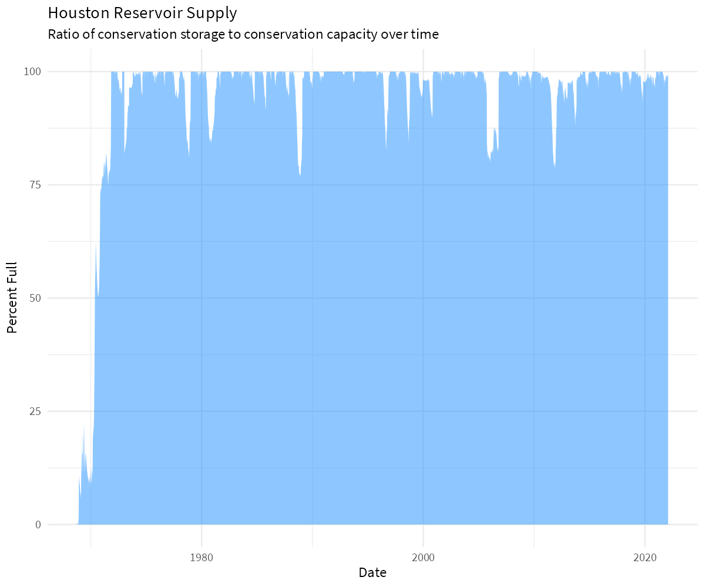
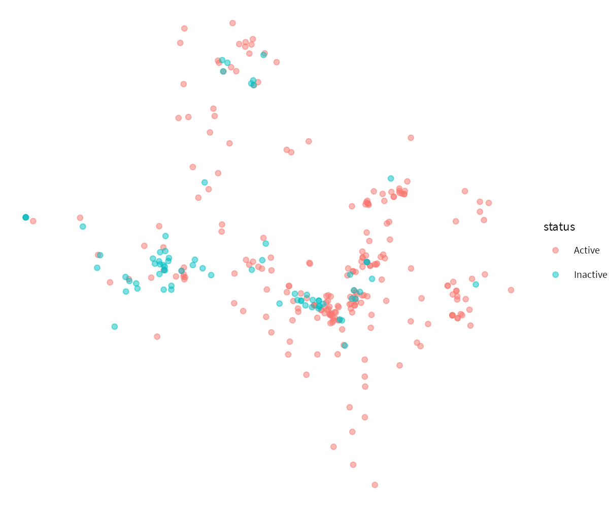
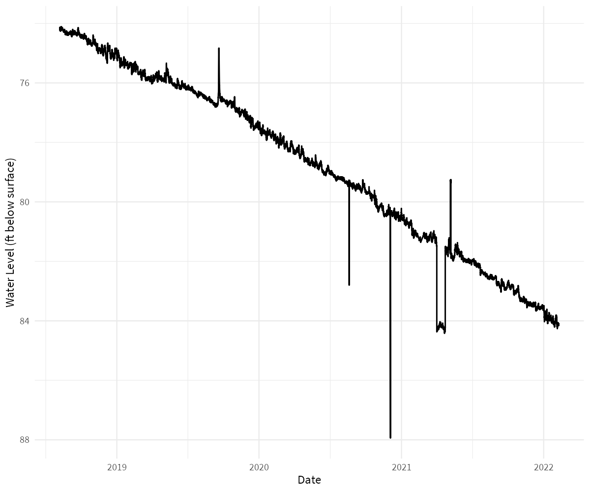

<!-- README.md is generated from README.Rmd. Please edit that file -->
wd4tx
=====

[](https://www.tidyverse.org/lifecycle/#experimental)

`wd4tx` provides an R interface for downloading data from the Texas Water Development Board's (TWDB) Water Data For Texas data portal (waterdatafortexas.org). This package is not affliated with the TWDB. Any questions or issues should be directed to: <https://github.com/mps9506/wd4tx/issues>

Installation
============

`wd4tx` is not published to CRAN. In order to install the package make sure you have `devtools` installed.

``` r
install.packages("devtools")
devtools::install_github("mps9506/wd4tx")
```

Usage
=====

Download Reservoir Storage Data
-------------------------------

TWDB provides data for the percent storage, reservoir storage (acre-feet), conservation storage (acre-feet), and conservation capacity (acre-feet) for the water supply (and some flood control) reservoirs used by the state of Texas. The data is available for individual reservoirs, or aggregated by state planning area, river basin, municipal supply, and climate regions. See <https://www.waterdatafortexas.org/reservoirs/statewide> for more details.

### Download individual reservoir storage data

``` r
library(wd4tx)
library(tidyverse)

df <- download_reservoir(reservoir = "limestone")
df <- df %>%
  mutate(date = as.Date(date),
         water_level = as.numeric(water_level),
         surface_area = as.numeric(surface_area))

ggplot(df) +
  geom_area(aes(date, percent_full), 
            fill = "dodgerblue",
            alpha = 0.50) +
  labs(y = "Percent Full", x = "Date",
       title = "Lake Limestone",
       subtitle = "Ratio of conservation storage to conservation capacity over time") +
  theme_minimal(base_family = "Arial Narrow")
```


### Download reservoir storage data aggregated by municipality

``` r

df <- download_reservoir(aggregate_by = "municipal",
                         region_name = "houston")
df <- df %>%
  mutate(date = as.Date(date))

ggplot(df) +
  geom_area(aes(date, percent_full), 
            fill = "dodgerblue",
            alpha = 0.50) +
  labs(y = "Percent Full", x = "Date",
       title = "Houston Reservoir Supply",
       subtitle = "Ratio of conservation storage to conservation capacity over time") +
  theme_minimal(base_family = "Arial Narrow")
```



Download Individual Well Data
-----------------------------

TWDB provides water level measurements from a statewide network of well level recorders. To download the information, all that is needed is the state well number. This information can be accessed with the `download_well_meta()` function. This will provide a `sf` dataframe:

``` r
df <- download_well_meta()

df
#> Simple feature collection with 286 features and 6 fields
#> geometry type:  POINT
#> dimension:      XY
#> bbox:           xmin: -106.6058 ymin: 26.04472 xmax: -94.07056 ymax: 36.24333
#> epsg (SRID):    4326
#> proj4string:    +proj=longlat +datum=WGS84 +no_defs
#> # A tibble: 286 x 7
#>    aquifer aquifer_type county entity status well_number
#>    <chr>   <chr>        <chr>  <chr>  <chr>  <chr>      
#>  1 Carriz~ Confined     Ander~ Texas~ Active 3813106    
#>  2 Ogalla~ Unconfined   Armst~ Panha~ Inact~ 0652603    
#>  3 Ogalla~ Unconfined   Armst~ Panha~ Active 0653401    
#>  4 Ogalla~ Unconfined   Armst~ Panha~ Active 0655504    
#>  5 Carriz~ Confined     Atasc~ Texas~ Active 7804508    
#>  6 Ogalla~ Unconfined   Bailey Texas~ Active 1051909    
#>  7 Edward~ Unconfined   Bande~ U.S. ~ Active 6912206    
#>  8 Trinity Confined     Bande~ Texas~ Active 6924225    
#>  9 Carriz~ Unconfined   Bastr~ Texas~ Active 5862208    
#> 10 Seymour Unconfined   Baylor Texas~ Active 2122850    
#> # ... with 276 more rows, and 1 more variable: geometry <POINT [°]>
```

``` r
ggplot(df) +
  geom_sf(aes(color = status, fill = status), alpha = 0.5) +
  theme_void(base_family = "Arial Narrow")
```



``` r
df <- download_well("6507905")

df <- df %>%
  mutate(datetime = as.POSIXct(datetime))

ggplot(df) +
  geom_line(aes(datetime, `water_level(ft below land surface)`)) +
  scale_y_reverse() +
  labs(y = "Water Level (ft below surface)",
       x = "Date") +
  theme_minimal(base_family = "Arial Narrow")
```


